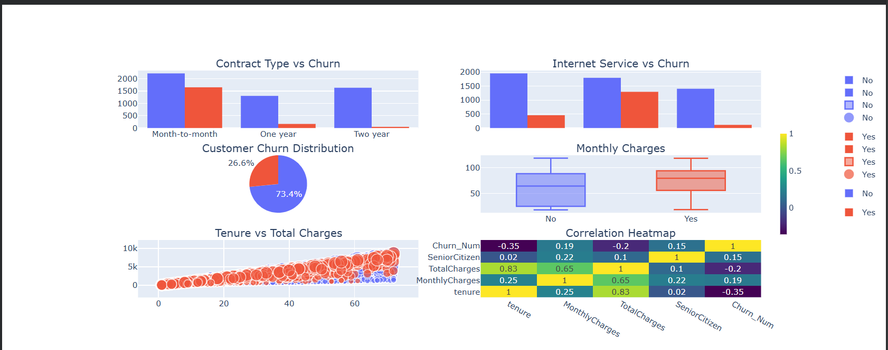

# Customer Churn Analysis

## Project Overview
This project analyzes telecom customer churn using Python and data visualization techniques. The main goal is to identify the factors that influence customer churn and provide business insights to improve customer retention.

## Project Objective
- Analyze customer churn patterns.
- Understand the impact of contract type, internet service, monthly charges, and tenure.
- Generate business insights using data visualization.

## Technologies Used
- Python
- Pandas
- NumPy
- Matplotlib
- Plotly

## Dashboard Preview

## Key Analysis
- Customer Churn Distribution
- Contract Type vs Churn
- Internet Service vs Churn
- Monthly Charges Analysis
- Tenure vs Total Charges
- Correlation Heatmap

## Business Insights
- Customers with **Month-to-Month** contracts have the highest churn rate.
- Customers with **higher monthly charges** are more likely to churn.
- Customers with **longer tenure** are more likely to stay.
- Long-term contracts help reduce customer churn.

## Future Improvements
- Build a Machine Learning model to predict customer churn.
- Deploy the project using Streamlit.
- Create an interactive Power BI Dashboard.

## Project Structure

Customer-Churn-Analysis/
│── Customer_Churn_Analysis.ipynb
│── dashboard.png
│── README.md

## Author

**Jay Rathod**

IMCA (Artificial Intelligence & Machine Learning)

GitHub: https://github.com/jr92654832229-ctrl
